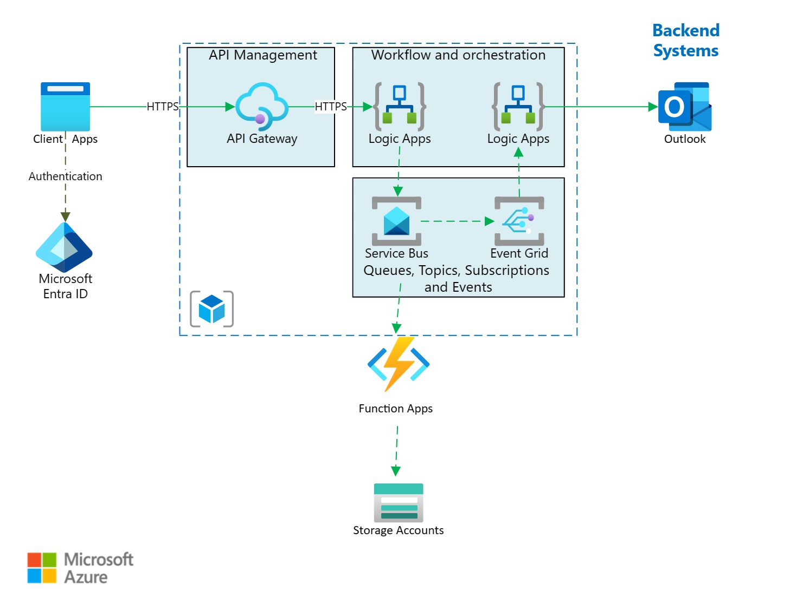

# Azure Integration Services Example




### Deploy apps to Azure 

#### Deploy to Azure for dev-test

NOTE: make sure you have Azure Dev CLI pre-reqs [here](https://learn.microsoft.com/en-us/azure/developer/azure-developer-cli/install-azd?tabs=winget-windows%2Cbrew-mac%2Cscript-linux&pivots=os-windows) and are on version 0.9.0-beta.3 or greater.

1. Clone this project  

```bash

``` 


2. Run the following command to package a deployable copy of your application, provision the template's infrastructure to Azure and also deploy the application code to those newly provisioned resources.

```bash
azd up
```

This command will prompt you for the following information:
- `Azure Location`: The Azure location where your resources will be deployed.
- `Azure Subscription`: The Azure Subscription where your resources will be deployed.

> NOTE: This may take a while to complete as it executes three commands: `azd package` (packages a deployable copy of your application),`azd provision` (provisions Azure resources), and `azd deploy` (deploys application code). You will see a progress indicator as it packages, provisions and deploys your application.
